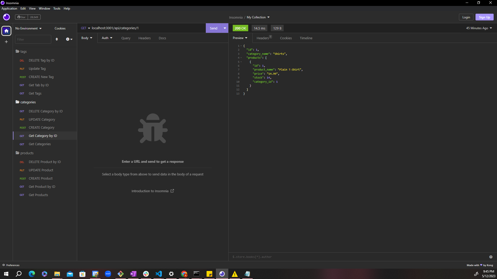

# 13 E-Commerce Back End
## Table of contents
- Overview
    - The Challenge
    - Screenshot
    - Links
- My Approach
    - Code construction
    - Learnings
- Author
## Overview

## The Challenge

GIVEN a functional Express.js API
WHEN I add my database name, MySQL username, and MySQL password to an environment variable file
THEN I am able to connect to a database using Sequelize
WHEN I enter schema and seed commands
THEN a development database is created and is seeded with test data
WHEN I enter the command to invoke the application
THEN my server is started and the Sequelize models are synced to the MySQL database
WHEN I open API GET routes in Insomnia for categories, products, or tags
THEN the data for each of these routes is displayed in a formatted JSON
WHEN I test API POST, PUT, and DELETE routes in Insomnia
THEN I am able to successfully create, update, and delete data in my database

## Screenshot

### Links
Github URL:  https://github.com/amalahema/ecommerce

### Code Construction
- mysql2
- sequelize,express & node.js
- env file & Router

### Learnings
- How do import sequelize and connect with the server
- How to create a database in the schema  and  design the table 
- How to add a reference to the table and join the data of the multiple tables
- How to display data for the particular URL
- How to get, post, and delete the data in the table
- How to import the router to index.js
- How to use async and await
- How to use try and catch method

Walkthrough Video:
https://drive.google.com/file/d/119ilNPooaXCnpfFmGMCdBm-ogHV3LMhs/view

